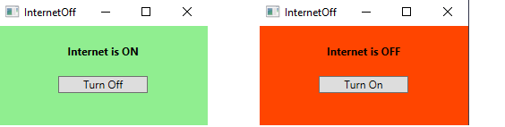

# InternetOff

Sometimes you just want to make sure that nothing on your PC is talking to the Internet. InternetOff is a small (14K) program for Windows 8.1 or Windows 10 which turns access to the Internet off and on again, without affecting access to the local network.

It doesn't do anything that you couldn't do yourself using the Windows Defender Firewall UI, but it does it with the press of a single button, with no need to remember the required firewall rule options.

This is what it looks like:

There are just two states, Internet on and Internet off, and a button to switch between them.

Changing firewall rules requires administrator privileges. I have released InternetOff as open source because I wouldn't trust any download that wasn't fully transparent with such privileges, so why should you? Instructions for building the program can be found in the root directory of the source.

To install InternetOff ready built, download the InternetOff.zip file from the Releases tab, and extract the two files that it contains to wherever you keep your program files.
## How it works
It used to be quite hard to turn off access to the Internet without also turning off access to the local network. InternetOff takes advantage of a Firewall enhancement delivered in Windows 8.1 (or possibly Windows 8, but I don't have a copy to check) which allows you to specifically block access to Internet addresses only. The price is that InternetOff does not work on Windows 7.

Another convenient way that you could do this yourself is using PowerShell 3 or later (PowerShell 3 shipped with Windows 8). In fact, given that the Windows API doesn't seem to have caught up with the new option mentioned above, InternetOff itself works by issuing the very same PowerShell commands.

Three commands are involved.

1. Add the firewall rule to block Internet access:

  New-NetFirewallRule -Name "Block Internet" -DisplayName "Block Internet access" -Description "Used to block all internet access" -Enabled True -Direction Outbound -Action Block -InterfaceType Any -RemoteAddress Internet

2. Remove the firewall rule that blocks Internet access:

  Remove-NetFirewallRule -Name "Block Internet"
  
3. Find out if the firewall rule that blocks Internet access is already set up. This is used when InternetOff starts to find out what the current state is:

  Get-NetFirewallRule -Name "Block Internet"
 
So, whether you use these commands directly, or take advantage of the simple one click interface offered by InternetOff, happy offlining!